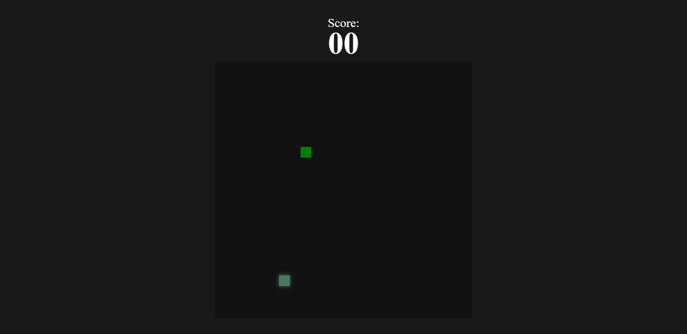

# Projeto JavaScript - Snake Game 🐍🎮

## 🧠 Sobre o Projeto

Este é um clássico jogo da cobrinha desenvolvido com JavaScript e a API do `<canvas>`. O jogador deve controlar a cobra utilizando as setas do teclado, comer os blocos coloridos para crescer e acumular pontos, evitando colisões com as bordas ou consigo mesma.

O jogo também conta com pontuação dinâmica, sistema de game over, botão para reinício e um efeito sonoro ao comer a comida.

## 🖥️ Tecnologias Utilizadas

- HTML5
- CSS3
- JavaScript
- Canvas API

## 🎮 Funcionalidades

- Controle por teclado (setas direcionais)
- Pontuação progressiva
- Reinício automático ao fim da partida
- Geração aleatória de comida com cores variadas
- Efeito sonoro ao comer

## 📸 Prévia

> *Imagem ilustrativa da versão desktop do jogo.*

## 🔗 Acesse Online

[👉 Clique aqui para jogar](https://luis-fellipe.github.io/jogo-da-cobrinha-js/)

## 💼 Meu LinkedIn

[www.linkedin.com/in/luis-fellipe-real](https://www.linkedin.com/in/luis-fellipe-real)
